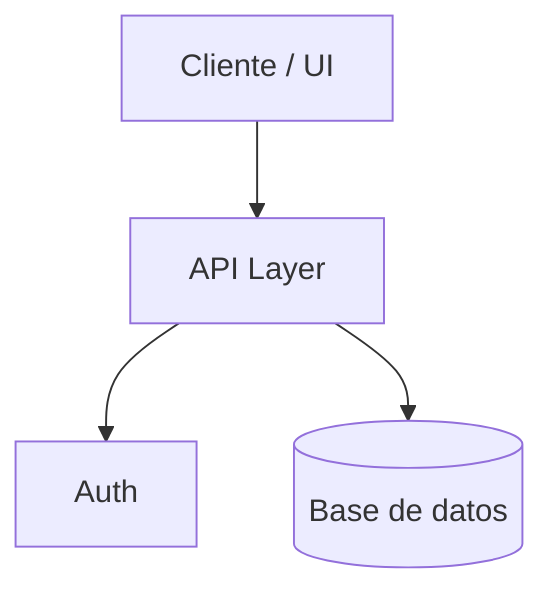

# ARCHITECTURE.md — {{Nombre del Proyecto}}

> Se llena en el Paso 02, junto con DOMAIN.md, DATABASE.md y CONVENTIONS.md. Este archivo describe el "cómo se conectan las piezas", no el detalle de cada endpoint (eso va en API.md).

## Stack tecnológico
| Capa | Tecnología | Motivo de la elección (ver DECISIONS.md si hubo alternativas) |
|---|---|---|
| Frontend | | |
| Backend / API | | |
| Base de datos | | |
| Auth | | |
| Hosting / Deploy | | |
| Validación | (ej. Zod) | |

## Diagrama de componentes

*(reemplazar con el diagrama real del proyecto)*

## Componentes clave
### Frontend
- Estructura de carpetas:
- Manejo de estado:
- Manejo de formularios / validación en cliente:

### Auth (Autenticación)
- Proveedor / estrategia (sesión, JWT, OAuth, magic link...):
- Dónde vive la sesión:
- Ver matriz de roles y permisos completa en `SECURITY.md`.

### API
- Estilo (REST, RPC, Server Actions...):
- Convención de rutas:
- Detalle de endpoints → `API.md`.

### Database
- Motor:
- Estrategia de migraciones:
- Esquema detallado → `DATABASE.md`.

### UI/UX
- Sistema de diseño / librería de componentes:
- Lineamientos de accesibilidad:

## Flujo de datos típico
{{Describe el recorrido de una petición típica de punta a punta: Cliente → ... → Respuesta.}}

## Entornos y variables de entorno
| Variable | Entorno | Descripción | ¿Sensible? |
|---|---|---|---|
| | dev / prod | | Sí/No |

## Restricciones de infraestructura conocidas
{{Ej: recursos de hardware limitados, ancho de banda, límites del hosting elegido.}}
