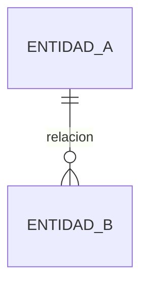

# DATABASE.md — {{Nombre del Proyecto}}

> Se llena en el Paso 02 como borrador y se refina en el Paso 03 a medida que se construye cada bloque. Todo cambio de esquema en producción se anota también como ADR en DECISIONS.md.

## Motor y convenciones
- **Motor:** {{PostgreSQL / MySQL / SQLite / ...}}
- **ORM / query builder:** {{Prisma / Drizzle / Eloquent / ...}}
- **Convención de nombres de tablas/columnas:** {{snake_case / camelCase, singular/plural}}

## Diagrama entidad-relación

*(reemplazar con el ERD real)*

## Esquema de tablas
### `{{tabla_a}}`
| Columna | Tipo | Restricciones | Descripción |
|---|---|---|---|
| id | | PK | |
| | | | |

**Índices:**
-

**Relaciones:**
-

*(repetir por cada tabla)*

## Schemas de validación (Zod u otro validador)
```ts
// Ejemplo — reemplazar con los schemas reales del proyecto
const {{Entidad}}Schema = z.object({
  id: z.string().uuid(),
  // ...
});
```

## Estrategia de migraciones
{{Cómo se versionan y aplican los cambios de esquema — herramienta usada, convención de nombres de migraciones, proceso de rollback.}}

## Datos sensibles y retención
{{Qué columnas contienen datos sensibles (PII, credenciales, financieros) y cuál es la política de retención/borrado.}}
