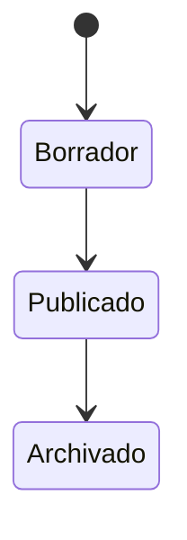

# DOMAIN.md — {{Nombre del Proyecto}}

> Se llena en el Paso 02. Este es el "idioma ubicuo" del proyecto: los términos y reglas de negocio que TODOS —tú, el equipo, y cualquier agente de IA— deben usar exactamente igual, sin sinónimos sueltos.

## Glosario de dominio
| Término | Definición | Sinónimos a evitar |
|---|---|---|
| | | *(ej: no usar "cliente" y "usuario" indistintamente si significan cosas distintas)* |

## Entidades principales
### {{Entidad A}}
- **Descripción:**
- **Atributos clave:**
- **Reglas de negocio asociadas:**
  -
- **Relaciones con otras entidades:**

*(repetir por cada entidad principal)*

## Reglas de negocio globales
{{Reglas que aplican transversalmente, no a una sola entidad. Ej: "un usuario no puede tener más de una sesión activa", "toda transacción debe quedar auditada".}}

## Estados y transiciones (si aplica)

*(reemplazar con el flujo de estados real de la entidad relevante)*

## Casos límite conocidos
{{Situaciones excepcionales que el negocio ya sabe que van a pasar y hay que contemplar: datos duplicados, usuarios sin rol asignado, fechas límite vencidas, etc.}}
