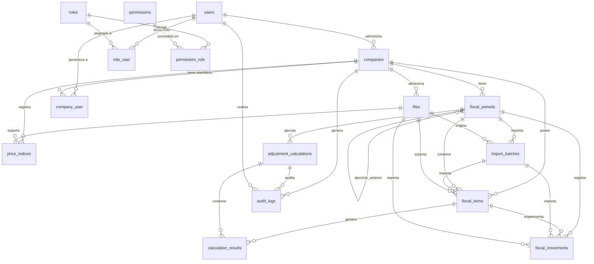

# DATABASE.md — Sistema de Ajuste por Inflación Fiscal (SAIRFI)

> Revisión 2026-09-26 (v2). Se llena en el Paso 02 como borrador y se refina en el Paso 03 a medida que se construye cada bloque. Todo cambio de esquema en producción se anota también como ADR en `DECISIONS.md`. Ver "Registro de mejoras" para el detalle de qué cambió respecto a la versión anterior y por qué.

## 0. Registro de mejoras de esta revisión

| # | Problema detectado en la versión anterior | Corrección aplicada |
|---|---|---|
| 1 | `DOMAIN.md` §6.1 usa el estado `PENDIENTE_DE_CLASIFICACION` para partidas sin fecha de adquisición, pero `fiscal_items.estado` no lo incluía en su enumeración. | Agregado `PENDIENTE_DE_CLASIFICACION` a `fiscal_items.estado` (§3, tabla `fiscal_items`) y a `FiscalItemSchema` (§4). |
| 2 | El único índice único de `fiscal_periods` era `(company_id, fecha_inicio, fecha_cierre)`, que solo evita fechas exactas duplicadas — no impide dos ejercicios con fechas distintas ambos `ABIERTO` para la misma empresa, aunque `DOMAIN.md` R-204 lo exige. | Se añade un índice único parcial `(company_id) WHERE estado NOT IN ('CERRADO', 'ANULADO')` (§3, tabla `fiscal_periods`) que sí aplica R-204. |
| 3 | `company_user.rol_en_empresa` estaba marcado como "eliminar" en la nota de §7 pero seguía apareciendo como columna real del esquema — documentación contradictoria (el diagrama decía una cosa, la tabla otra). | Columna eliminada del esquema; §7.4 ahora describe la decisión ya tomada, no una pendiente. |
| 4 | Tres nombres distintos para FKs hacia `files` con el mismo propósito semántico ("documento de soporte"): `fiscal_items.documento_soporte_id`, `price_indices.archivo_soporte_id`, `fiscal_movements.documento_soporte_id`. | Se estandariza a `documento_soporte_id` en las tres tablas; `import_batches.archivo_id` se conserva con nombre distinto porque no es un soporte sino el archivo importado en sí (la convención se explicita en §3). |
| 5 | No había ninguna nota que dejara claro que este esquema (`roles`, `permissions`, `role_user`, `permission_role`, 5 roles) es el **objetivo de Fase 1+** y que el MVP en código hoy usa un modelo distinto y más simple (`users.role: ADMIN \| RESPONDENT`, ver `SECURITY.md`), pese a que `TODO.md` ya documenta el bloqueo B-01 por esta misma divergencia. | Añadida nota explícita al inicio de §3 y en la tabla `users`/`roles`. |

***

## 1. Motor y convenciones

| Aspecto | Decisión |
|---|---|
| **Motor de base de datos** | **PostgreSQL 18.x** (última versión estable, alojado en **Neon.tech**) |
| **ORM** | **Prisma ORM 7.x** |
| **Convención de nombres de tablas** | **snake_case**, plural (`companies`, `fiscal_periods`, `fiscal_items`) |
| **Convención de nombres de columnas** | **snake_case** (`created_at`, `fiscal_period_id`, `valor_historico`) |
| **Convención de nombres de relaciones** | Sustantivo en plural para colecciones (`fiscalItems`, `adjustmentCalculations`) |
| **Convención de FK hacia `files`** | `documento_soporte_id` cuando el archivo respalda otra entidad (partida, movimiento, índice); `archivo_id` cuando el archivo **es** el objeto principal del registro (p. ej. el archivo importado en `import_batches`) |
| **Claves primarias** | `id` de tipo `String` (UUID v4) para todas las tablas |
| **Fechas** | `DateTime` con precisión de segundos, almacenadas en UTC |
| **Valores monetarios** | `Decimal` con precisión `@db.Decimal(18, 2)` |
| **Índices de precios** | `Decimal` con precisión `@db.Decimal(20, 6)` (hasta 999 billones con 6 decimales; el INPC venezolano supera el rango de `Decimal(10,5)`, ver §7) |
| **Campos auditables** | `createdAt`, `updatedAt` en todas las tablas mediante `@updatedAt` |
| **Excepción de convención** | `createdAt`/`updatedAt` van en camelCase (default de Prisma) y se mapean a `created_at`/`updated_at` vía `@map` |

**Justificación de PostgreSQL 18.x:**

- Última versión estable disponible (lanzada en octubre 2025).
- Mejoras en rendimiento de consultas complejas y transaccionales.
- Optimizaciones en índices y planificación de consultas.
- Mejor soporte para operaciones con `JSONB` y funciones de ventana.
- Neon.tech soporta nativamente PostgreSQL 18.x con connection pooling.
- Compatibilidad total con Prisma ORM 7.x.

***

## 2. Diagrama entidad-relación



***

## 3. Esquema de tablas

> **Alcance de esta sección:** este es el esquema **objetivo de Fase 1+** (`TODO.md`, Fase 1 en adelante). El MVP de recolección que existe hoy en código (`prisma/schema.prisma`, Fase M) usa un modelo más simple y **distinto**: `users.role` es un enum de 2 valores (`ADMIN` / `RESPONDENT`, ver `SECURITY.md` §Autorización) en vez de las tablas `roles`/`permissions`/`role_user`/`permission_role` de aquí, y no existen todavía `companies`, `fiscal_periods`, `fiscal_items`, etc. La migración de un modelo al otro está bloqueada por **B-01** (`TODO.md`) hasta que exista el plan de reconciliación (ADR-011). No dupliques tablas del MVP contra este documento sin pasar antes por ese ADR.

### `companies`

| Columna | Tipo | Restricciones | Descripción |
|---|---|---|---|
| `id` | `String` | `@id @default(uuid())` | Identificador único de la empresa |
| `nombre` | `String` | `@db.VarChar(255) @notNull` | Razón social |
| `rif` | `String` | `@unique @db.VarChar(20) @notNull` | Registro de Información Fiscal |
| `direccion_fiscal` | `String?` | `@db.Text` | Dirección registrada |
| `actividad_economica` | `String?` | `@db.VarChar(255)` | Descripción de la actividad |
| `fecha_inicio_operaciones` | `DateTime?` | | Fecha de inicio de operaciones |
| `fecha_cierre_fiscal_habitual` | `String?` | `@db.VarChar(5)` | Día y mes de cierre habitual (ej: "12-31") |
| `estado` | `String` | `@default("ACTIVA") @db.VarChar(20)` | `ACTIVA`, `INACTIVA`, `ARCHIVADA` |
| `configuracion` | `Json?` | | Configuración específica (redondeo, moneda, etc.) |
| `createdAt` | `DateTime` | `@default(now())` | Fecha de creación |
| `updatedAt` | `DateTime` | `@updatedAt` | Fecha de última actualización |

**Índices:**

- `rif` (único)
- `estado`

**Relaciones:**

- `fiscal_periods` (1:N)
- `price_indices` (1:N)
- `fiscal_items` (1:N)
- `audit_logs` (1:N)
- `users` (N:M a través de `company_user`)

***

### `fiscal_periods`

| Columna | Tipo | Restricciones | Descripción |
|---|---|---|---|
| `id` | `String` | `@id @default(uuid())` | Identificador único |
| `company_id` | `String` | `@notNull @references(companies(id))` | Referencia a la empresa |
| `fecha_inicio` | `DateTime` | `@notNull` | Fecha de inicio del ejercicio |
| `fecha_cierre` | `DateTime` | `@notNull` | Fecha de cierre del ejercicio |
| `estado` | `String` | `@default("BORRADOR") @db.VarChar(30)` | `BORRADOR`, `ABIERTO`, `PENDIENTE_DE_REVISION`, `APROBADO`, `CERRADO`, `REABIERTO` |
| `tipo` | `String` | `@default("REGULAR") @db.VarChar(20)` | `INICIAL`, `REGULAR` |
| `ejercicio_anterior_id` | `String?` | `@references(fiscal_periods(id))` | Referencia al ejercicio anterior |
| `aprobado_por_id` | `String?` | `@references(users(id))` | Usuario que aprobó |
| `aprobado_en` | `DateTime?` | | Fecha de aprobación |
| `cerrado_en` | `DateTime?` | | Fecha de cierre |
| `createdAt` | `DateTime` | `@default(now())` | |
| `updatedAt` | `DateTime` | `@updatedAt` | |

**Índices:**

- `company_id`
- `estado`
- `tipo`
- `ejercicio_anterior_id`
- Índice único compuesto: `(company_id, fecha_inicio, fecha_cierre)` (evita ejercicios duplicados con las mismas fechas exactas)
- **Índice único parcial:** `(company_id) WHERE estado NOT IN ('CERRADO', 'ANULADO')` — aplica DOMAIN.md R-204 ("no dos ejercicios abiertos a la vez"); el índice de fechas exactas por sí solo no lo garantizaba (ver §0, corrección #2)

**Relaciones:**

- `company` (N:1)
- `ejercicio_anterior` (N:1 auto-referencial)
- `fiscal_items` (1:N)
- `fiscal_movements` (1:N)
- `adjustment_calculations` (1:N)
- `import_batches` (1:N)

***

### `price_indices`

| Columna | Tipo | Restricciones | Descripción |
|---|---|---|---|
| `id` | `String` | `@id @default(uuid())` | Identificador único |
| `company_id` | `String?` | `@references(companies(id))` | Empresa asociada (nullable para índices globales) |
| `tipo` | `String` | `@default("INPC") @db.VarChar(20) @notNull` | Tipo de índice |
| `fuente` | `String` | `@db.VarChar(100) @notNull` | Organismo emisor |
| `anio` | `Int` | `@notNull` | Año del índice |
| `mes` | `Int` | `@notNull` | Mes del índice (1-12) |
| `valor` | `Decimal` | `@notNull @db.Decimal(20, 6)` | Valor del índice |
| `version` | `Int` | `@default(1) @notNull` | Número de versión |
| `estado` | `String` | `@default("BORRADOR") @db.VarChar(20)` | `BORRADOR`, `APROBADO`, `REEMPLAZADO` |
| `documento_soporte_id` | `String?` | `@references(files(id))` | Documento de soporte (renombrado desde `archivo_soporte_id`, ver §0 corrección #4) |
| `aprobado_por_id` | `String?` | `@references(users(id))` | Usuario que aprobó |
| `aprobado_en` | `DateTime?` | | Fecha de aprobación |
| `createdAt` | `DateTime` | `@default(now())` | |
| `updatedAt` | `DateTime` | `@updatedAt` | |

**Índices:**

- `company_id`
- `tipo`
- `fuente`
- `anio`
- `mes`
- `estado`
- Índice único parcial (índices globales): `(tipo, fuente, anio, mes, version)` `WHERE company_id IS NULL`
- Índice único parcial (por empresa): `(company_id, tipo, fuente, anio, mes, version)` `WHERE company_id IS NOT NULL`
- ⚠️ `company_id` es nullable: un único índice compuesto con NULL permitiría duplicados en PostgreSQL (los NULL no se consideran iguales entre sí); por eso se usan dos índices parciales (ver §7).

**Relaciones:**

- `company` (N:1, nullable)
- `documento_soporte` (N:1, nullable)
- `aprobado_por` (N:1, nullable)

***

### `fiscal_items`

| Columna | Tipo | Restricciones | Descripción |
|---|---|---|---|
| `id` | `String` | `@id @default(uuid())` | Identificador único |
| `company_id` | `String` | `@notNull @references(companies(id))` | Empresa |
| `fiscal_period_id` | `String` | `@notNull @references(fiscal_periods(id))` | Ejercicio fiscal |
| `cuenta_contable` | `String` | `@db.VarChar(50) @notNull` | Código de cuenta contable |
| `nombre_cuenta` | `String` | `@db.VarChar(255) @notNull` | Nombre de la cuenta |
| `tipo` | `String` | `@db.VarChar(20) @notNull` | `ACTIVO`, `PASIVO`, `PATRIMONIO` |
| `clasificacion_monetaria` | `String?` | `@db.VarChar(20)` | `MONETARIA`, `NO_MONETARIA`; nullable mientras `estado = PENDIENTE_DE_CLASIFICACION` (DOMAIN.md §6.1) |
| `categoria_fiscal` | `String?` | `@db.VarChar(50)` | Categoría fiscal específica; nullable mientras `estado = PENDIENTE_DE_CLASIFICACION` |
| `fecha_adquisicion` | `DateTime?` | | Fecha de adquisición o incorporación |
| `valor_historico` | `Decimal` | `@notNull @db.Decimal(18, 2)` | Valor histórico original |
| `valor_fiscal_base` | `Decimal` | `@notNull @db.Decimal(18, 2)` | Valor base para cálculo |
| `ajuste_acumulado` | `Decimal` | `@default(0) @db.Decimal(18, 2)` | Ajuste acumulado de períodos anteriores |
| `valor_fiscal_actualizado` | `Decimal` | `@db.Decimal(18, 2)` | Valor actualizado (calculado) |
| `indice_base` | `Decimal?` | `@db.Decimal(20, 6)` | Índice base aplicado |
| `indice_cierre` | `Decimal?` | `@db.Decimal(20, 6)` | Índice de cierre aplicado |
| `factor_aplicado` | `Decimal?` | `@db.Decimal(20, 8)` | Factor de actualización aplicado (snapshot del último cálculo aprobado, ver §7) |
| `vida_util` | `Int?` | | Vida útil en años (para activos depreciables) |
| `metodo_depreciacion` | `String?` | `@db.VarChar(50)` | Método de depreciación fiscal |
| `estado` | `String` | `@default("ACTIVA") @db.VarChar(30)` | `ACTIVA`, `VENDIDA`, `DADA_DE_BAJA`, `CANCELADA`, `SUSPENDIDA`, `PENDIENTE_DE_CLASIFICACION` (agregado, ver §0 corrección #1 y DOMAIN.md §4.4/§6.1) |
| `documento_soporte_id` | `String?` | `@references(files(id))` | Documento de soporte |
| `createdAt` | `DateTime` | `@default(now())` | |
| `updatedAt` | `DateTime` | `@updatedAt` | |

**Reglas de aplicación (servicio, no CHECK de base de datos):**

- Si `estado = PENDIENTE_DE_CLASIFICACION`, el servicio debe rechazar que la partida entre a cualquier `adjustment_calculation` (R-403).
- `clasificacion_monetaria` y `categoria_fiscal` son obligatorias en la capa de aplicación en cuanto `estado` deja de ser `PENDIENTE_DE_CLASIFICACION`.

**Índices:**

- `company_id`
- `fiscal_period_id`
- `tipo`
- `clasificacion_monetaria`
- `categoria_fiscal`
- `cuenta_contable`
- `estado`
- Índice compuesto: `(fiscal_period_id, clasificacion_monetaria)` (filtro típico del motor de cálculo)

**Relaciones:**

- `company` (N:1)
- `fiscal_period` (N:1)
- `fiscal_movements` (1:N)
- `calculation_results` (1:N)
- `documento_soporte` (N:1, nullable)

***

### `fiscal_movements`

| Columna | Tipo | Restricciones | Descripción |
|---|---|---|---|
| `id` | `String` | `@id @default(uuid())` | Identificador único |
| `fiscal_item_id` | `String` | `@notNull @references(fiscal_items(id))` | Partida fiscal |
| `fiscal_period_id` | `String` | `@notNull @references(fiscal_periods(id))` | Ejercicio fiscal |
| `tipo` | `String` | `@db.VarChar(30) @notNull` | `ADQUISICION`, `INCORPORACION`, `MEJORA`, `DEPRECIACION`, `AMORTIZACION`, `VENTA`, `RETIRO`, `BAJA`, `CANCELACION`, `RECLASIFICACION`, `CORRECCION` |
| `fecha` | `DateTime` | `@notNull` | Fecha del movimiento |
| `valor` | `Decimal` | `@notNull @db.Decimal(18, 2)` | Valor del movimiento |
| `documento_soporte_id` | `String?` | `@references(files(id))` | Documento de soporte |
| `indice_base` | `Decimal?` | `@db.Decimal(20, 6)` | Índice base del movimiento |
| `indice_cierre` | `Decimal?` | `@db.Decimal(20, 6)` | Índice de cierre aplicado |
| `factor_aplicado` | `Decimal?` | `@db.Decimal(20, 8)` | Factor calculado |
| `ajuste_generado` | `Decimal?` | `@db.Decimal(18, 2)` | Ajuste resultante |
| `observaciones` | `String?` | `@db.Text` | Observaciones del movimiento |
| `createdAt` | `DateTime` | `@default(now())` | |
| `updatedAt` | `DateTime` | `@updatedAt` | |

**Índices:**

- `fiscal_item_id`
- `fiscal_period_id`
- `tipo`
- `fecha`

**Relaciones:**

- `fiscal_item` (N:1)
- `fiscal_period` (N:1)
- `documento_soporte` (N:1, nullable)

***

### `adjustment_calculations`

| Columna | Tipo | Restricciones | Descripción |
|---|---|---|---|
| `id` | `String` | `@id @default(uuid())` | Identificador único |
| `company_id` | `String` | `@notNull @references(companies(id))` | Empresa |
| `fiscal_period_id` | `String` | `@notNull @references(fiscal_periods(id))` | Ejercicio fiscal |
| `tipo` | `String` | `@db.VarChar(30) @notNull` | `AJUSTE_INICIAL`, `REAJUSTE_REGULAR` |
| `fecha_calculo` | `DateTime` | `@notNull` | Fecha de ejecución |
| `version_reglas` | `String` | `@db.VarChar(50) @notNull` | Versión de reglas aplicadas (formato `reglas@v<semver>`, ver §7) |
| `version_indices` | `String` | `@db.VarChar(50) @notNull` | Versión de índices aplicados (snapshot de los `price_indices` usados, ver §7) |
| `estado` | `String` | `@default("BORRADOR") @db.VarChar(30)` | `BORRADOR`, `CALCULADO`, `PENDIENTE_DE_REVISION`, `APROBADO`, `CERRADO`, `ANULADO` |
| `ajuste_total_activos` | `Decimal?` | `@db.Decimal(18, 2)` | Suma de ajustes de activos |
| `ajuste_total_pasivos` | `Decimal?` | `@db.Decimal(18, 2)` | Suma de ajustes de pasivos |
| `efecto_neto_patrimonio` | `Decimal?` | `@db.Decimal(18, 2)` | Efecto neto sobre patrimonio |
| `aprobado_por_id` | `String?` | `@references(users(id))` | Usuario que aprobó |
| `aprobado_en` | `DateTime?` | | Fecha de aprobación |
| `cerrado_en` | `DateTime?` | | Fecha de cierre |
| `observaciones` | `String?` | `@db.Text` | Observaciones del cálculo |
| `createdAt` | `DateTime` | `@default(now())` | |
| `updatedAt` | `DateTime` | `@updatedAt` | |

**Índices:**

- `company_id`
- `fiscal_period_id`
- `tipo`
- `estado`

**Relaciones:**

- `company` (N:1)
- `fiscal_period` (N:1)
- `calculation_results` (1:N)
- `aprobado_por` (N:1, nullable)
- `audit_logs` (1:N)

***

### `calculation_results`

| Columna | Tipo | Restricciones | Descripción |
|---|---|---|---|
| `id` | `String` | `@id @default(uuid())` | Identificador único |
| `adjustment_calculation_id` | `String` | `@notNull @references(adjustment_calculations(id))` | Cálculo de ajuste |
| `fiscal_item_id` | `String` | `@notNull @references(fiscal_items(id))` | Partida fiscal |
| `valor_base` | `Decimal` | `@notNull @db.Decimal(18, 2)` | Valor fiscal base |
| `indice_base` | `Decimal` | `@notNull @db.Decimal(20, 6)` | Índice base aplicado |
| `indice_cierre` | `Decimal` | `@notNull @db.Decimal(20, 6)` | Índice de cierre aplicado |
| `factor_aplicado` | `Decimal` | `@notNull @db.Decimal(20, 8)` | Factor calculado |
| `valor_actualizado` | `Decimal` | `@notNull @db.Decimal(18, 2)` | Valor actualizado |
| `ajuste_generado` | `Decimal` | `@notNull @db.Decimal(18, 2)` | Ajuste individual |
| `createdAt` | `DateTime` | `@default(now())` | |

**Índices:**

- `adjustment_calculation_id`
- `fiscal_item_id`
- Índice único compuesto: `(adjustment_calculation_id, fiscal_item_id)` (un resultado por partida y cálculo)

**Relaciones:**

- `adjustment_calculation` (N:1)
- `fiscal_item` (N:1)

***

### `import_batches`

| Columna | Tipo | Restricciones | Descripción |
|---|---|---|---|
| `id` | `String` | `@id @default(uuid())` | Identificador único |
| `fiscal_period_id` | `String` | `@notNull @references(fiscal_periods(id))` | Ejercicio fiscal |
| `tipo` | `String` | `@db.VarChar(30) @notNull` | `FISCAL_ITEMS`, `FISCAL_MOVEMENTS` |
| `nombre_archivo` | `String` | `@db.VarChar(255) @notNull` | Nombre del archivo original |
| `archivo_id` | `String` | `@references(files(id))` | Archivo importado (el archivo *es* el objeto del registro, no un soporte — ver convención en §1) |
| `filas_totales` | `Int` | `@notNull` | Número total de filas |
| `filas_validas` | `Int` | `@notNull` | Filas procesadas exitosamente |
| `filas_rechazadas` | `Int` | `@notNull` | Filas con errores |
| `estado` | `String` | `@default("PROCESADO") @db.VarChar(20)` | `PENDIENTE`, `PROCESADO`, `FALLIDO` |
| `errores` | `Json?` | | Detalle de errores por fila |
| `importado_por_id` | `String` | `@references(users(id))` | Usuario que importó |
| `createdAt` | `DateTime` | `@default(now())` | |

**Índices:**

- `fiscal_period_id`
- `tipo`
- `estado`

**Relaciones:**

- `fiscal_period` (N:1)
- `archivo` (N:1)
- `importado_por` (N:1)

***

### `audit_logs`

Bitácora única append-only (ADR-011): el modelo MVP (`entity`, `metadata`, `submissionId`) se extendió con `companyId` + `oldValues`/`newValues` en vez de crear una tabla fiscal separada. Los nombres MVP se conservan; no se renombran columnas.

| Columna | Tipo | Restricciones | Descripción |
|---|---|---|---|
| `id` | `String` | `@id @default(cuid())` | Identificador único |
| `user_id` | `String` | `@references(users(id))` | Usuario que realizó la acción |
| `company_id` | `String?` | `@references(companies(id))` | Empresa asociada (null en eventos del levantamiento) |
| `submission_id` | `String?` | `@references(form_submissions(id))` | Levantamiento asociado (null en eventos fiscales) |
| `action` | `AuditAction` (enum) | `@notNull` | Tipo de acción; valores fiscales se agregan con `ALTER TYPE ... ADD VALUE` |
| `entity` | `String` | `@db.VarChar(50)` → texto | Tipo de entidad afectada |
| `entity_id` | `String` | `@db.VarChar(100)` → texto | ID de la entidad |
| `metadata` | `Json?` | | Metadatos curados del evento (nunca secretos ni PII) |
| `old_values` / `new_values` | `Json?` | | Valores antes/después (solo eventos fiscales) |
| `ip_address` | `String?` | `@db.VarChar(45)` | Dirección IP |
| `user_agent` | `String?` | | Agente de usuario |
| `createdAt` | `DateTime` | `@default(now())` | |

**Índices:**

- `user_id`
- `company_id`
- `submission_id`
- `action`
- Índice compuesto: `(entity, entity_id)` (consulta típica de historial por entidad)
- `createdAt`

**Relaciones:**

- `user` (N:1)
- `company` (N:1, nullable)
- `submission` (N:1, nullable)

***

### `users`

| Columna | Tipo | Restricciones | Descripción |
|---|---|---|---|
| `id` | `String` | `@id @default(cuid())` | Identificador único |
| `nombre` | `String` | `@db.VarChar(255) @notNull` | Nombre completo |
| `email` | `String` | `@unique @db.VarChar(255) @notNull` | Correo electrónico |
| `password_hash` | `String` | `@db.VarChar(255) @notNull` | Contraseña cifrada (bcrypt, cost 12) |
| `active` | `Boolean` | `@default(true)` | `SUSPENDIDO ≡ active=false`; el código de sesión depende de esta columna |
| `ultimo_acceso` | `DateTime?` | | Último inicio de sesión |
| `createdAt` | `DateTime` | `@default(now())` | |
| `updatedAt` | `DateTime` | `@updatedAt` | |

> Reconciliado por ADR-011 (Fase 1.1, migración `20260926120000_fase1_fiscal_core`): **sin** columna `role` — la autorización vive en `role_user`/`permission_role`. Se conserva `active` en vez del `estado` original de este documento para no romper el código de sesión probado.

**Índices:**

- `email` (único)
- `active`

**Relaciones:**

- `companies` (N:M a través de `company_user`)
- `roles` (N:M a través de `role_user`)
- `audit_logs` (1:N)

***

### `company_user`

Modela **pertenencia** (qué usuarios pertenecen a qué empresa). La autorización por rol vive por completo en `role_user` + `permission_role` (ver §7.4) — esta tabla no lleva columna de rol.

| Columna | Tipo | Restricciones | Descripción |
|---|---|---|---|
| `company_id` | `String` | `@notNull @references(companies(id)) @id` | Empresa |
| `user_id` | `String` | `@notNull @references(users(id)) @id` | Usuario |
| `createdAt` | `DateTime` | `@default(now())` | |

**Índices:**

- `company_id`
- `user_id`

**Relaciones:**

- `company` (N:1)
- `user` (N:1)

***

### `roles`

| Columna | Tipo | Restricciones | Descripción |
|---|---|---|---|
| `id` | `String` | `@id` (fijo, no cuid) | Identificador determinista para backfills (`role-admin`, `role-analyst`, `role-accountant`, `role-advisor`, `role-auditor`) |
| `nombre` | `String` | `@unique @db.VarChar(50) @notNull` | Nombre del rol en minúsculas (`administrador`, `analista`, `contador`, `asesor_tributario`, `auditor` — ver `ARCHITECTURE.md` §4.2) |
| `descripcion` | `String?` | `@db.Text` | Descripción |
| `createdAt` | `DateTime` | `@default(now())` | |

**Relaciones:**

- `users` (N:M a través de `role_user`)
- `permissions` (N:M a través de `permission_role`)

***

### `permissions`

| Columna | Tipo | Restricciones | Descripción |
|---|---|---|---|
| `id` | `String` | `@id @default(uuid())` | Identificador único |
| `nombre` | `String` | `@unique @db.VarChar(100) @notNull` | Nombre del permiso |
| `descripcion` | `String?` | `@db.Text` | Descripción |
| `recurso` | `String` | `@db.VarChar(50) @notNull` | Recurso al que aplica |
| `accion` | `String` | `@db.VarChar(50) @notNull` | Acción permitida |
| `createdAt` | `DateTime` | `@default(now())` | |

**Índices:**

- Índice único compuesto: `(recurso, accion)`

**Relaciones:**

- `roles` (N:M a través de `permission_role`)

***

### `role_user`

| Columna | Tipo | Restricciones | Descripción |
|---|---|---|---|
| `role_id` | `String` | `@notNull @references(roles(id)) @id` | Rol |
| `user_id` | `String` | `@notNull @references(users(id)) @id` | Usuario |
| `createdAt` | `DateTime` | `@default(now())` | |

**Relaciones:**

- `role` (N:1)
- `user` (N:1)

***

### `permission_role`

| Columna | Tipo | Restricciones | Descripción |
|---|---|---|---|
| `permission_id` | `String` | `@notNull @references(permissions(id)) @id` | Permiso |
| `role_id` | `String` | `@notNull @references(roles(id)) @id` | Rol |
| `createdAt` | `DateTime` | `@default(now())` | |

**Relaciones:**

- `permission` (N:1)
- `role` (N:1)

***

### `files`

| Columna | Tipo | Restricciones | Descripción |
|---|---|---|---|
| `id` | `String` | `@id @default(uuid())` | Identificador único |
| `company_id` | `String?` | `@references(companies(id))` | Empresa asociada |
| `nombre_original` | `String` | `@db.VarChar(255) @notNull` | Nombre original del archivo |
| `nombre_almacenado` | `String` | `@db.VarChar(255) @notNull` | Nombre en almacenamiento |
| `tipo_mime` | `String` | `@db.VarChar(100) @notNull` | Tipo MIME |
| `tamano_bytes` | `Int` | `@notNull` | Tamaño en bytes |
| `url` | `String` | `@db.Text @notNull` | URL firmada o path de acceso (las URLs de Blob superan 500 caracteres) |
| `subido_por_id` | `String` | `@references(users(id))` | Usuario que subió |
| `createdAt` | `DateTime` | `@default(now())` | |

**Índices:**

- `company_id`
- `subido_por_id`

**Relaciones:**

- `company` (N:1, nullable)
- `subido_por` (N:1, nullable)

***

## 4. Schemas de validación (Zod)

```ts
// src/lib/validators/company.validator.ts
import { z } from 'zod';

export const CompanySchema = z.object({
  id: z.string().uuid(),
  nombre: z.string().min(1).max(255),
  rif: z.string().regex(/^[VEPGJ]-\d{8}-\d$/, "RIF venezolano válido (V/E/P/G/J)"),
  direccion_fiscal: z.string().max(500).optional(),
  actividad_economica: z.string().max(255).optional(),
  fecha_inicio_operaciones: z.string().datetime().optional(),
  fecha_cierre_fiscal_habitual: z.string().regex(/^\d{2}-\d{2}$/).optional(),
  estado: z.enum(['ACTIVA', 'INACTIVA', 'ARCHIVADA']),
  configuracion: z.record(z.unknown()).optional(),
  createdAt: z.string().datetime(),
  updatedAt: z.string().datetime(),
});

export type Company = z.infer<typeof CompanySchema>;

export const CreateCompanySchema = CompanySchema.omit({
  id: true,
  createdAt: true,
  updatedAt: true,
});

export const UpdateCompanySchema = CreateCompanySchema.partial();
```

```ts
// src/lib/validators/fiscal-period.validator.ts
import { z } from 'zod';

export const FiscalPeriodSchema = z.object({
  id: z.string().uuid(),
  company_id: z.string().uuid(),
  fecha_inicio: z.string().datetime(),
  fecha_cierre: z.string().datetime(),
  estado: z.enum(['BORRADOR', 'ABIERTO', 'PENDIENTE_DE_REVISION', 'APROBADO', 'CERRADO', 'REABIERTO']),
  tipo: z.enum(['INICIAL', 'REGULAR']),
  ejercicio_anterior_id: z.string().uuid().optional(),
  aprobado_por_id: z.string().uuid().optional(),
  aprobado_en: z.string().datetime().optional(),
  cerrado_en: z.string().datetime().optional(),
  createdAt: z.string().datetime(),
  updatedAt: z.string().datetime(),
}).refine(
  (data) => new Date(data.fecha_cierre) > new Date(data.fecha_inicio),
  { message: 'fecha_cierre debe ser posterior a fecha_inicio', path: ['fecha_cierre'] }
);

export type FiscalPeriod = z.infer<typeof FiscalPeriodSchema>;

export const CreateFiscalPeriodSchema = FiscalPeriodSchema.omit({
  id: true,
  createdAt: true,
  updatedAt: true,
  aprobado_por_id: true,
  aprobado_en: true,
  cerrado_en: true,
});

export const UpdateFiscalPeriodSchema = CreateFiscalPeriodSchema.partial();
```

```ts
// src/lib/validators/fiscal-item.validator.ts
import { z } from 'zod';

export const FiscalItemSchema = z.object({
  id: z.string().uuid(),
  company_id: z.string().uuid(),
  fiscal_period_id: z.string().uuid(),
  cuenta_contable: z.string().min(1).max(50),
  nombre_cuenta: z.string().min(1).max(255),
  tipo: z.enum(['ACTIVO', 'PASIVO', 'PATRIMONIO']),
  // nullable/optional: puede no estar asignada mientras estado = PENDIENTE_DE_CLASIFICACION (DOMAIN.md §6.1)
  clasificacion_monetaria: z.enum(['MONETARIA', 'NO_MONETARIA']).optional(),
  categoria_fiscal: z.string().min(1).max(50).optional(),
  fecha_adquisicion: z.string().datetime().optional(),
  valor_historico: z.string().regex(/^\d+(\.\d{1,2})?$/),
  valor_fiscal_base: z.string().regex(/^\d+(\.\d{1,2})?$/),
  ajuste_acumulado: z.string().regex(/^\d+(\.\d{1,2})?$/).optional(),
  valor_fiscal_actualizado: z.string().regex(/^\d+(\.\d{1,2})?$/).optional(),
  indice_base: z.string().regex(/^\d+(\.\d{1,6})?$/).optional(),
  indice_cierre: z.string().regex(/^\d+(\.\d{1,6})?$/).optional(),
  factor_aplicado: z.string().regex(/^\d+(\.\d{1,8})?$/).optional(),
  vida_util: z.number().int().positive().optional(),
  metodo_depreciacion: z.string().max(50).optional(),
  // PENDIENTE_DE_CLASIFICACION agregado — ver §0 corrección #1
  estado: z.enum(['ACTIVA', 'VENDIDA', 'DADA_DE_BAJA', 'CANCELADA', 'SUSPENDIDA', 'PENDIENTE_DE_CLASIFICACION']),
  documento_soporte_id: z.string().uuid().optional(),
  createdAt: z.string().datetime(),
  updatedAt: z.string().datetime(),
}).refine(
  (data) => data.estado === 'PENDIENTE_DE_CLASIFICACION' || (!!data.clasificacion_monetaria && !!data.categoria_fiscal),
  { message: 'clasificacion_monetaria y categoria_fiscal son obligatorias salvo en PENDIENTE_DE_CLASIFICACION', path: ['clasificacion_monetaria'] }
);

export type FiscalItem = z.infer<typeof FiscalItemSchema>;

export const CreateFiscalItemSchema = FiscalItemSchema.omit({
  id: true,
  createdAt: true,
  updatedAt: true,
  ajuste_acumulado: true,
  valor_fiscal_actualizado: true,
  indice_base: true,
  indice_cierre: true,
  factor_aplicado: true,
});

export const UpdateFiscalItemSchema = CreateFiscalItemSchema.partial();
```

```ts
// src/lib/validators/adjustment-calculation.validator.ts
import { z } from 'zod';

export const AdjustmentCalculationSchema = z.object({
  id: z.string().uuid(),
  company_id: z.string().uuid(),
  fiscal_period_id: z.string().uuid(),
  tipo: z.enum(['AJUSTE_INICIAL', 'REAJUSTE_REGULAR']),
  fecha_calculo: z.string().datetime(),
  version_reglas: z.string().min(1).max(50),
  version_indices: z.string().min(1).max(50),
  estado: z.enum(['BORRADOR', 'CALCULADO', 'PENDIENTE_DE_REVISION', 'APROBADO', 'CERRADO', 'ANULADO']),
  ajuste_total_activos: z.string().regex(/^\d+(\.\d{1,2})?$/).optional(),
  ajuste_total_pasivos: z.string().regex(/^\d+(\.\d{1,2})?$/).optional(),
  efecto_neto_patrimonio: z.string().regex(/^-?\d+(\.\d{1,2})?$/).optional(),
  aprobado_por_id: z.string().uuid().optional(),
  aprobado_en: z.string().datetime().optional(),
  cerrado_en: z.string().datetime().optional(),
  observaciones: z.string().optional(),
  createdAt: z.string().datetime(),
  updatedAt: z.string().datetime(),
});

export type AdjustmentCalculation = z.infer<typeof AdjustmentCalculationSchema>;

export const CreateAdjustmentCalculationSchema = AdjustmentCalculationSchema.omit({
  id: true,
  fecha_calculo: true,
  createdAt: true,
  updatedAt: true,
  aprobado_por_id: true,
  aprobado_en: true,
  cerrado_en: true,
  ajuste_total_activos: true,
  ajuste_total_pasivos: true,
  efecto_neto_patrimonio: true,
});
```

***

## 5. Estrategia de migraciones

| Aspecto | Decisión |
|---|---|
| **Herramienta** | Prisma Migrate (`prisma migrate dev`, `prisma migrate deploy`) |
| **Convención de nombres** | `{timestamp}_{descripcion_corta}.sql` (generado automáticamente por Prisma) |
| **Ubicación** | `prisma/migrations/` |
| **Desarrollo** | `prisma migrate dev --name {descripcion}` crea migración y aplica a DB local |
| **Producción** | `prisma migrate deploy` aplica migraciones pendientes en DB de producción |
| **Rollback** | `prisma migrate resolve --rolled-back {migration_name}` para marcar como revertida |
| **Seed** | `prisma db seed` para datos iniciales (roles, permisos, usuarios admin) |
| **Validación** | CI ejecuta `prisma generate` y valida que el schema compile antes de deploy |

**Proceso de cambio de esquema:**

1. Modificar `schema.prisma`.
2. Ejecutar `prisma migrate dev --name descripcion_cambio`.
3. Revisar SQL generado en `prisma/migrations/{timestamp}_descripcion_cambio/migration.sql`.
4. Probar localmente con datos de prueba.
5. Commit del cambio a Git.
6. En producción: `prisma migrate deploy`.
7. Registrar el cambio en `DECISIONS.md` como ADR si es relevante.

**Consideraciones para PostgreSQL 18.x:**

- Habilitar `previewFeatures` en Prisma si alguna característica de PostgreSQL 18 no está totalmente soportada.
- Usar el adaptador de Neon para connection pooling: `?pgbouncer=true` en `DATABASE_URL`.
- Aprovechar mejoras de rendimiento en índices y consultas complejas.
- Monitorear compatibilidad de extensiones si se requieren en el futuro.

**Prerrequisito antes de escribir la primera migración de Fase 1 (`TODO.md` B-01):** redactar ADR-011 con el plan de reconciliación MVP↔fiscal — qué pasa con `users.role`, si `sessions`/`form_submissions`/`attachments` se conservan o se reemplazan, y cómo migran los datos ya recolectados.

***

## 6. Datos sensibles y retención

### 6.1. Columnas con datos sensibles

| Tabla | Columna | Tipo de dato sensible |
|---|---|---|
| `users` | `email` | PII (información de contacto) |
| `users` | `password_hash` | Credencial de autenticación |
| `companies` | `rif` | Identificador fiscal |
| `companies` | `direccion_fiscal` | Información de ubicación |
| `audit_logs` | `ip_address` | Dato de conexión |
| `fiscal_items` | `documento_soporte_id` | Referencia a documentos fiscales |
| `files` | `url`, `nombre_original` | Metadatos de archivos |

### 6.2. Política de retención

| Dato | Política de retención |
|---|---|
| `audit_logs` | Retención indefinida (no se eliminan, solo se archivan) |
| `users` | Se mantienen mientras la cuenta esté activa; borrado lógico al desactivar |
| `companies` | Se mantienen mientras la empresa esté activa; archivado al inactivar |
| `fiscal_periods` | Retención mínima de 10 años (requisito legal tributario) |
| `fiscal_items` | Retención mínima de 10 años (requisito legal tributario) |
| `adjustment_calculations` | Retención mínima de 10 años (requisito legal tributario) |
| `files` | Se mantienen mientras el ejercicio no esté cerrado; luego archivados |

### 6.3. Borrado de datos

- **Borrado lógico:** La mayoría de las tablas usan campo `estado` para marcar como inactivo/archivado en lugar de eliminar físicamente.
- **Borrado físico:** Solo para datos temporales (archivos de importación fallida, sesiones expiradas).
- **Derecho al olvido:** No aplicable completamente debido a requisitos legales de retención tributaria (10 años mínimo).

### 6.4. Cifrado

- **En tránsito:** HTTPS obligatorio (provisto por Vercel y Neon.tech).
- **En reposo:** Neon.tech y PostgreSQL 18.x proveen cifrado automático de la base de datos.
- **Contraseñas:** Hash con bcrypt (costo 12, ver `SECURITY.md`).
- **Cookies de sesión:** `httpOnly`, `secure` en producción, `sameSite=lax` (ver `SECURITY.md` — no `strict`, porque rompería flujos de navegación entrante habituales).

***

## 7. Notas de normalización y decisiones físicas (revisión 2026-09-26)

El esquema está en **tercera forma normal (3NF)** salvo las excepciones documentadas aquí, todas intencionales. Cada excepción tiene regla de escritura que preserva la integridad.

### 7.1. Denormalizaciones intencionales (con regla de escritura)

| Excepción | Dónde | Justificación | Regla que la protege |
|---|---|---|---|
| `fiscal_items.company_id` (transitiva vía `fiscal_period_id`) | `fiscal_items` | Filtros directos por empresa sin join; particionado futuro | CHECK a nivel de servicio: `item.company_id = period.company_id` al crear; idealmente FK compuesta `(company_id, fiscal_period_id)` |
| Snapshot del último cálculo (`valor_fiscal_actualizado`, `indice_base`, `indice_cierre`, `factor_aplicado`) | `fiscal_items` | Lectura rápida del estado vigente sin recorrer `calculation_results`; la historia completa vive en `calculation_results` | Solo el motor de cálculo puede escribirlas, y únicamente al aprobar un cálculo (DOMAIN.md R-403/R-404) |
| `nombre_cuenta` + `cuenta_contable` sin catálogo | `fiscal_items` | v1 importa planes contables heterogéneos desde Excel/CSV; no hay catálogo único todavía | En v2, extraer a tabla `chart_of_accounts` y dejar aquí solo FK (ver ADR-010 en `DECISIONS.md`) |
| `configuracion`, `errores`, `valores_anteriores/nuevos` como `Json` | `companies`, `import_batches`, `audit_logs` | Atributos semiestructurados y variables por empresa/lote/evento; normalizarlos crearía tablas EAV peores | Schemas Zod por tipo de contenido; nunca PII sensible en `metadata` libre (ver `SECURITY.md`) |

### 7.2. Precisión numérica e hiperinflación

- Índices `Decimal(20,6)` y factores `Decimal(20,8)`: el INPC venezolano alcanza órdenes de magnitud que desbordan `Decimal(10,5)` (máx. 99.999,99999) y los factores de actualización pueden superar 100 (límite de `Decimal(10,8)`). 6 decimales en índices cumplen DOMAIN.md R-501 (mínimo 5); 8 en factores cumplen R-502.
- Dinero `Decimal(18,2)` con redondeo **al presentar, no al calcular** (R-504); la estrategia de redondeo configurable vive en `companies.configuracion` (R-505).

### 7.3. Unicidad con NULL y estados como String

- `price_indices.company_id` nullable distingue índices globales (`NULL`) de específicos por empresa. Como PostgreSQL no considera iguales dos NULL en un índice único, se usan **dos índices parciales** en lugar de uno compuesto (ver § `price_indices`). El mismo patrón de índice parcial se reutiliza en `fiscal_periods` para aplicar R-204 (§0 corrección #2, § `fiscal_periods`).
- `estado`/`tipo`/`categoria_fiscal` son `String` + validación Zod en la app (no enums nativos PG) para permitir evolución sin migraciones bloqueantes. Cada migración que agregue un valor nuevo debe añadir el `CHECK` correspondiente; los valores válidos están listados en cada tabla y en DOMAIN.md §3.5. El agregado de `PENDIENTE_DE_CLASIFICACION` a `fiscal_items.estado` en esta revisión es un ejemplo de ese proceso: se documenta aquí y en DOMAIN.md antes de escribir la migración.

### 7.4. Sistema de roles único

- `company_user` modela **pertenencia** (qué usuarios pertenecen a qué empresa); `role_user` + `permission_role` modelan **autorización**. La columna `rol_en_empresa`, que existía en un borrador anterior de este esquema, se eliminó por duplicar ambos conceptos: dos fuentes de rol divergen inevitablemente (ya había ocurrido en la definición inicial). `company_user` no debe volver a llevar columnas de rol.

### 7.5. Versiones como texto estructurado

- `version_reglas` (`reglas@v<semver>`) y `version_indices` (snapshot etiquetado de los `price_indices` usados) son texto con formato convencional, no FK, porque congelan el pasado: una FK apuntaría al dato vivo y rompería la reproducibilidad histórica (ADR-009). Si en v2 aparece una tabla `rule_versions`, estos campos pasan a ser su etiqueta, nunca FK viva.

### 7.6. Convención unificada de FK hacia `files`

- Antes de esta revisión existían tres nombres distintos (`documento_soporte_id`, `archivo_soporte_id`, `archivo_id`) sin regla explícita. Ahora: `documento_soporte_id` en toda tabla donde el archivo **respalda** otro dato (`fiscal_items`, `fiscal_movements`, `price_indices`); `archivo_id` únicamente en `import_batches`, donde el archivo es el objeto que se procesa, no un soporte adicional.

***

## 8. Relaciones con otros documentos

| Documento | Relación con DATABASE.md |
|---|---|
| `PROJECT.md` | Define los datos que el sistema debe gestionar. |
| `ARCHITECTURE.md` | Describe cómo se accede a la base de datos desde la arquitectura. |
| `DOMAIN.md` | Proporciona las entidades y reglas que este esquema modela; los estados de `fiscal_items.estado` y el índice parcial de `fiscal_periods` existen para satisfacer R-005/R-403 y R-204 respectivamente. |
| `API.md` | Define los contratos de datos que se persisten en este esquema. |
| `SECURITY.md` | Especifica cómo se protegen los datos sensibles modelados aquí; documenta también el modelo de roles real del MVP (`ADMIN`/`RESPONDENT`), distinto del objetivo de §3. |
| `CONVENTIONS.md` | Establece cómo se escribe el código Prisma y las consultas. |
| `DECISIONS.md` | Registra cambios de esquema relevantes como ADRs; ADR-011 (pendiente) debe resolver la reconciliación mencionada en §3 y §5. |
| `TODO.md` | Controla el estado de implementación de cada tabla o migración; B-01 bloquea la migración de este esquema hasta que exista ADR-011. |

***

> **Nota:** Este documento debe revisarse cada vez que se modifique el `schema.prisma`. Todo cambio de esquema en producción debe anotarse también como ADR en `DECISIONS.md`.

**Actualización:** PostgreSQL 18.x es la versión estable más reciente (lanzada en octubre 2025). Neon.tech soporta nativamente esta versión con todas sus mejoras de rendimiento y características avanzadas.