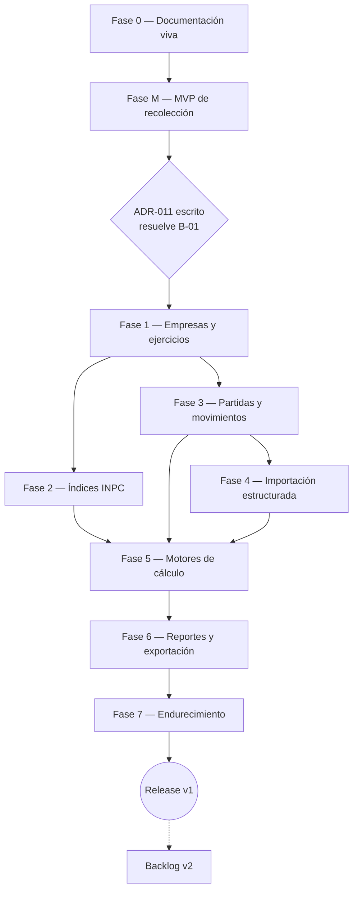

# ROADMAP.md — SAIRFI

> Roadmap derivado del estado real documentado en `TODO.md` (fuente de verdad de progreso), `DATABASE.md`, `ARCHITECTURE.md`, `SECURITY.md`, `DOMAIN.md`, `DECISIONS.md` y `PROJECT.md`. No introduce fases nuevas que esos documentos no contemplen — las reorganiza como secuencia navegable con dependencias, criterios de salida y riesgos explícitos. Las fechas no se fijan en calendario (no hay ninguna comprometida en los documentos fuente); se usa tamaño relativo (S/M/L/XL) para ordenar prioridades. Actualizar este documento cada vez que cambie el estado en `TODO.md`.

## Cómo leer este roadmap

- **Estado**: se copia literalmente de `TODO.md` (🔲 Por hacer · 🔄 En progreso · 🧪 En pruebas · ✅ Hecho · ⛔ Bloqueado). Si hay discrepancia, `TODO.md` manda.
- **Depende de**: fases o bloqueos que deben resolverse antes de empezar. No hay saltos de fase — cada una asume que las anteriores cerraron su criterio de salida.
- **Criterio de salida**: condición binaria para considerar la fase terminada, tomada del checklist de `TODO.md` §"Checklist de validación por bloque".
- **Tamaño**: S (días) · M (1-2 semanas) · L (semanas) · XL (requiere partirse en sub-bloques antes de estimar). Relativo, no calendario.

***

## Vista general de la secuencia

> Nota de lectura del diagrama: Fase 2 y Fase 3 pueden avanzar en paralelo una vez cerrada Fase 1 (no tienen dependencia entre sí); Fase 4 depende de Fase 3 (necesita el modelo de partidas ya definido) pero no de Fase 2. Fase 5 necesita las tres.

***

## Fase 0 — Documentación viva y fundaciones

**Estado:** ✅ Hecho · **Depende de:** nada · **Tamaño:** ya ejecutada

**Qué se logró:** los 9 documentos vivos (`PROJECT`, `ARCHITECTURE`, `DOMAIN`, `DATABASE`, `CONVENTIONS`, `DECISIONS`, `SECURITY`, `TODO`, `API`) están redactados y sin marcadores de plantilla pendientes.

**Deudas cerradas 2026-09-26 (Fase 0 sin pendientes):**
- ~~Instalar Vitest + MSW + Playwright~~ — instalado (`vitest`, `msw`, `@playwright/test` + RTL/jsdom/plugin-react); `npm test` en verde con humo `src/lib/validation/__tests__/auth.test.ts` (3/3); config `vitest.config.mts` + `tests/setup.ts`.
- ~~B-02: `PROJECT.md` § Contexto todavía dice PHP/Laravel~~ — resuelto (stack → Next.js/Vercel/Neon).

**Criterio de salida (ya cumplido):** los 9 documentos existen, están revisados y no tienen contradicciones sin anotar entre sí.

***

## Fase M — MVP de recolección

**Estado:** ✅ Hecho (4 bloques con checklist Paso 04 completo) · **Depende de:** Fase 0 · **Tamaño:** M (cerrar lo que falta, no construir desde cero)

**Qué ya existe en código:** auth + sesiones `httpOnly` (`src/proxy.ts`, `src/lib/auth/`), levantamientos y secciones (borrador→envío), subida de adjuntos a Blob privado, panel admin (usuarios/auditoría/exportes).

**Lo que falta para cerrar la fase (en orden):**
1. ~~Instalar Vitest + MSW + Playwright (deuda de Fase 0)~~ — resuelto 2026-09-26, `npm test` operativo.
2. ~~Escribir la suite de tests de auth + sesiones (primer bloque candidato, según `CONVENTIONS.md` §7) y correrla contra `SECURITY.md`~~ — unitario en verde 2026-09-26 (15 tests: password, tokens, schemas); pendiente integración con DB.
3. ~~Cerrar el backlog documentado en `API.md` Fase M: H-M1 (carpetas vacías `api/auth/login|logout`) y D-M1…D-M4 (envolvente de error, auditoría de `SUBMISSION_DELETED` y de descargas de exportes)~~ — resuelto 2026-09-26 (migración `20260926000002_submission_deleted` aplicada y verificada en DB viva; `tsc` limpio, 15/15 tests).
4. ~~Correr el checklist completo de `TODO.md` sobre cada bloque 🧪 (auth, submissions, adjuntos, admin) y solo entonces marcarlos ✅~~ — hecho 2026-09-26 (39/39 tests: unit + integración DB + rutas HTTP; DB de pruebas limpia).

**Criterio de salida:** los 4 bloques de Fase M pasan el checklist de 6 puntos de `TODO.md` sin excepciones, y H-M1/D-M1…D-M4 están resueltos o movidos explícitamente a backlog v2 con justificación.

**Riesgo si se salta este cierre:** avanzar a Fase 1 con Fase M todavía en 🧪 significa migrar datos de un modelo sin tests — cualquier bug de auth o de propiedad de datos (IDOR) se arrastra a la reconciliación de B-01.

***

## Puerta de entrada a Fase 1 — ADR-011 (resuelve B-01)

**Estado:** ✅ Resuelto (ADR-011 aceptada 2026-09-26) · **Depende de:** Fase M cerrada · **Tamaño:** S (fue un documento de decisión, no código)

Esta no es una fase de construcción, es una **decisión obligatoria** antes de escribir la primera migración fiscal. `DATABASE.md` §3 y §5 ya advierten que su esquema (empresas, ejercicios, roles de 5 niveles) es incompatible con el `users`/`sessions`/`form_submissions` que hoy existe en producción.

**ADR-011 debe responder, como mínimo:**
- ¿`users.role` (enum `ADMIN`/`RESPONDENT`) se reemplaza por el modelo `roles`/`permissions`/`role_user`/`permission_role`, o convive con él durante una transición?
- ¿`sessions`, `form_submissions`, `sections`, `attachments` se conservan tal cual, se renombran, o se reemplazan por las tablas fiscales?
- ¿Cómo migran los datos ya recolectados en Fase M (usuarios reales, adjuntos ya subidos) sin perderlos?
- ¿Qué migración concreta de Prisma ejecuta el cambio, y en qué orden respecto al resto de Fase 1?

**Criterio de salida:** ADR-011 aprobado y registrado en `DECISIONS.md`; B-01 pasa de ⛔ a resuelto en `TODO.md`.

***

## Fase 1 — Núcleo fiscal: empresas y ejercicios

**Estado:** 🔲 Por hacer (desbloqueado por ADR-011) · **Depende de:** ADR-011 ✅ · **Tamaño:** L

**Bloques (orden sugerido):**
1. ~~Migración Prisma al modelo de `DATABASE.md` §3 + reconciliación de datos MVP (ejecuta lo que definió ADR-011)~~ — hecho 2026-09-26 (migración única revisada y verificada en vivo; suite 40/40).
2. ~~Seed de roles (5) + permisos + admin inicial, con la matriz RBAC de `SECURITY.md` ya extendida a los 5 roles~~ — hecho 2026-09-26 (seed idempotente, matriz ejecutable + documental, guardas disponibles).
3. ~~CRUD de empresas (RIF único, `configuracion` de redondeo)~~ — hecho 2026-09-26 (actions + rutas `/api/v1` + UI admin + suite).
4. ~~Ejercicios fiscales `INICIAL`/`REGULAR` — aquí se implementa el índice único parcial por `company_id` (`DATABASE.md` §3, tabla `fiscal_periods`) que aplica de verdad la regla R-204 ("un solo ejercicio abierto por empresa"), no solo el índice por fechas exactas.~~ — hecho 2026-09-26 (CRUD + open/close/reopen + UI + suite).
5. ~~Landing de SAIRFI en `/` con acceso al app (opción A, `TODO.md` backlog): evoluciona la página actual —deja de ser solo la puerta del levantamiento Fase M y pasa a presentar la propuesta de valor de `PROJECT.md` manteniendo el CTA según sesión (`/dashboard` o `/login`, ruta pública). Criterio propio: un visitante sin sesión entiende qué es SAIRFI y cómo entrar; un usuario autenticado llega al app en un clic.~~ — hecho 2026-09-26 (`LandingContent` puro + tests RTL; suite 61/61).

**Criterio de salida:** una empresa puede crearse, tener un ejercicio `INICIAL` abierto, y el sistema rechaza activamente un segundo ejercicio no cerrado para la misma empresa (test explícito de R-204, no solo revisión manual).

**Riesgo principal:** si la migración de datos de Fase M se hace sin transacción o sin plan de rollback, un fallo a mitad de migración puede dejar usuarios sin poder autenticarse. Mitigación: ensayar la migración completa contra una copia de producción antes de `prisma migrate deploy` real.

***

## Fase 2 — Índices INPC versionados

**Estado:** ✅ Hecho · **Depende de:** Fase 1 · **Tamaño:** M

**Bloques:**
1. ~~CRUD + flujo de aprobación (`BORRADOR` → `APROBADO` → `REEMPLAZADO`); un índice aprobado es inmutable (R-303).~~ — hecho 2026-09-26.
2. ~~Importación de índices desde CSV, distinguiendo índices globales (`company_id NULL`) de índices por empresa — cuidado con los dos índices únicos parciales de `price_indices` (`DATABASE.md` §3), no uno compuesto con NULL.~~ — hecho 2026-09-26 (errores por línea, auditoría del lote; suite 67/67, hermética entre corridas).

**Criterio de salida:** cargar un índice global y uno por empresa para el mismo año/mes no colisiona; corregir un índice aprobado genera una nueva versión (R-304) sin tocar la anterior, y los cálculos que ya la usaron quedan referenciados a esa versión (no a "el índice más reciente").

***

## Fase 3 — Partidas y movimientos

**Estado:** ✅ Hecho · **Depende de:** Fase 1 · **Tamaño:** L

**Bloques:**
1. ~~CRUD de partidas + clasificación monetaria/fiscal. Sin fecha de adquisición → `estado = PENDIENTE_DE_CLASIFICACION` (no rechazar el registro, ver `DOMAIN.md` §6.1 y `DATABASE.md` §3).~~ — hecho 2026-09-26.
2. ~~Movimientos del período (altas, bajas, depreciaciones, etc.), con `documento_soporte_id` hacia `files`.~~ — hecho 2026-09-26 (saldo disponible, neutros v1).
3. ~~Validaciones previas al cálculo (R-403/R-404): bloquear el avance a un cálculo si hay partidas `PENDIENTE_DE_CLASIFICACION` o índices faltantes, con mensaje accionable (no un error genérico).~~ — hecho 2026-09-26 (`period-readiness.ts` + ruta `/readiness`; suite 74/74).

**Criterio de salida:** una partida sin fecha se puede guardar (no bloquea la captura de datos) pero no puede entrar a un cálculo hasta que el contador la clasifique; el intento de calcular con partidas pendientes muestra qué partidas faltan, no solo que "falló".

***

## Fase 4 — Importación estructurada

**Estado:** ✅ Hecho · **Depende de:** Fase 3 · **Tamaño:** M

**Bloque único:** ~~plantillas XLSX/CSV + carga por lote + resumen de filas válidas/rechazadas + descarga de errores, registrado en `import_batches` y auditado.~~ — hecho 2026-09-26 (unifase con upsert/omisión, errores XLSX desde el lote, original en Blob; suite 81/81).

**Criterio de salida:** una carga de 100+ filas con errores mezclados produce un resumen correcto (cuántas válidas, cuántas rechazadas, por qué cada una) y permite reintentar solo las filas corregidas sin duplicar las que ya entraron.

**Nota:** este módulo importa **partidas y movimientos fiscales**; no debe confundirse ni reutilizar tal cual el importador de adjuntos del MVP (`POST /api/uploads`), que es un mecanismo distinto y más simple.

***

## Fase 5 — Motores de cálculo y aprobación

**Estado:** ✅ Hecho · **Depende de:** Fase 2, Fase 3, Fase 4 · **Tamaño:** XL (se partió en 5.1/5.2/5.3)

Esta es la fase de mayor riesgo del proyecto: es el motivo de ser del sistema y la que exige validación externa (el contador).

**Bloques (orden sugerido):**
1. ~~Funciones puras del motor (factor, valor actualizado, ajuste — R-101…R-109), con Vitest cubriendo casos que el contador haya validado a mano primero. **No escribir el flujo de aprobación antes de que las fórmulas tengan casos de prueba firmados por el contador** — es el punto donde un error es más caro de encontrar tarde.~~ — hecho 2026-09-26 (10 tests de referencia; R-108/R-109 siguen Propuesta, firma pendiente).
2. ~~Ajuste inicial + reajuste regular + consolidación, con snapshot en `fiscal_items` solo al aprobar (nunca antes, ver `DATABASE.md` §7.1).~~ — hecho 2026-09-26 (regular encadenado verificado a mano; versiones `inpc-sha`).
3. ~~Flujo revisión → aprobación → cierre + recálculo cuando un índice corregido lo dispare (R-304).~~ — hecho 2026-09-26 (revisión obligatoria, anulación con motivo, recálculo = nueva ejecución; notificación email pendiente sin SMTP; suite 97/97).

**Criterio de salida:** el motor reproduce, con al menos 3 casos reales aportados por el contador, el mismo resultado que el cálculo manual en Excel que SAIRFI busca reemplazar (ver métrica de éxito "Cero errores de fórmula" en `PROJECT.md`).

**Riesgo principal:** R-108 y R-109 siguen en estado "Propuesta" (no confirmadas normativamente) — no congelar su implementación en código hasta que el contador las confirme o las corrija; hacerlo antes es construir sobre una regla que puede cambiar.

***

## Fase 6 — Reportes y exportación

**Estado:** 🔲 Por hacer · **Depende de:** Fase 5 (necesita resultados de cálculo reales que reportar) · **Tamaño:** M

**Bloques:**
1. Balance fiscal + hoja de trabajo + consolidados, en XLSX/PDF/CSV con metadatos (fecha, usuario, versión).
2. Exportación auditada — cada descarga genera `audit_logs` y respeta propiedad/rol, siguiendo el mismo patrón que ya existe en `GET /api/export/[id]` del MVP.

**Criterio de salida:** un reporte exportado puede rastrearse hasta el cálculo, versión de reglas y versión de índices exactos que lo generaron (principio de trazabilidad, `DOMAIN.md` §2.3).

***

## Fase 7 — Endurecimiento previo al release

**Estado:** 🔲 Por hacer, pero **no bloquea** Fases 1-6 (ver B-03 en `TODO.md`) · **Depende de:** puede empezarse en paralelo desde Fase 1, debe cerrarse antes del release · **Tamaño:** M

**Bloques:**
1. Rate limiting + headers de seguridad (CSP/HSTS) + verificación de `Origin`/CSRF en mutaciones — implementa la tabla de límites ya definida en `SECURITY.md` §Rate limiting.
2. Auditoría e2e (Playwright: login → cálculo → aprobación → exporte) + prueba de restauración de Neon documentada.

**Criterio de salida:** B-03 se cierra en `TODO.md`; ningún endpoint de mutación acepta una petición sin `Origin` válido; existe al menos una restauración de backup probada y documentada.

> **Por qué no bloquea las fases anteriores:** construir el motor fiscal sin rate limiting no es peligroso per se; lanzarlo a producción sin él sí lo es. Por eso esta fase corre en paralelo pero es una puerta de salida obligatoria antes de `Release v1`, no un prerrequisito de Fase 1.

***

## Release v1

**Criterio de salida combinado:** Fases 1-6 con todos sus bloques ✅ (checklist de `TODO.md` cumplido) + Fase 7 cerrada + las métricas de éxito de `PROJECT.md` verificables (reducción de tiempo de cálculo, cero errores de fórmula, trazabilidad completa, al menos 2 ejercicios fiscales cerrados de punta a punta).

***

## Backlog v2 (después del release, sin fecha)

No forman parte de la secuencia de fases — son extensiones explícitamente pospuestas en `PROJECT.md` y `TODO.md`:

- Libros de compras/ventas, IVA mensual, retenciones IVA/ISLR, facturación electrónica.
- Inventarios con cantidades y costo unitario; activos fijos con depreciación automática; conciliación fiscal automática; presentación SENIAT.
- Extraer `chart_of_accounts` y `rule_versions` a tablas propias cuando el volumen lo justifique.
- API pública `/api/v1` con tokens por alcance + webhooks (`fiscal_period.closed`, `adjustment_calculation.approved`, …).
- Verificación MIME por firma + antivirus pre-servicio; múltiples ejercicios abiertos en paralelo (hoy prohibido por R-204 — requeriría revisar esa regla, no solo relajar el índice).

***

## Relación con otros documentos

| Documento | Relación con ROADMAP.md |
|---|---|
| `TODO.md` | Fuente de verdad del estado real de cada bloque; este roadmap se reordena a partir de ahí, nunca al revés. |
| `DATABASE.md` | Explica por qué Fase 1 no puede empezar sin ADR-011 (§3, aviso de alcance) y de dónde sale el criterio de salida de R-204. |
| `DOMAIN.md` | Fuente de las reglas (R-xxx) citadas como criterios de salida en cada fase. |
| `ARCHITECTURE.md` | Fuente de los componentes (motor de cálculo, importación, reportes) que cada fase construye. |
| `SECURITY.md` | Fuente de los criterios de salida de Fase 7. |
| `DECISIONS.md` | Donde se registra ADR-011 una vez redactado, y cualquier decisión que reordene este roadmap. |

***
